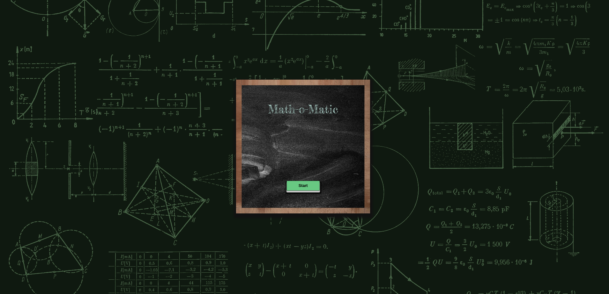

# Math-o-Matic

Warning: Vite enforces using jsx syntax inside jsx/tsx files, so it will complain about that. Solution: rename `.js` files to `.jsx` :)

Quick start:

```
$ npm install
$ npm start
````

```
$ pnpm install
$ pnpm start
````


Head over to https://vitejs.dev/ to learn more about using vite


## Test Your Children Math Knowledge

> Math O Matic a wonderful site, for your children who can answer the question and become first at class :)



1. What would be the answer? 
  + (9 + 4) = ?


Oh wow, you got it the answer is **_13_**


2. What would be the answer? 
  1. (5 * 8) = ?


  1. Is it _**14**_? 
  
  oh, no. It was Too Low. Just think

  2. Is it _**85**_?
  
  oh, no. It was _Too High_

  3. Is it _**40**_?
  
  oh, yaaayeee. You got it, your answer is correct. :-)

